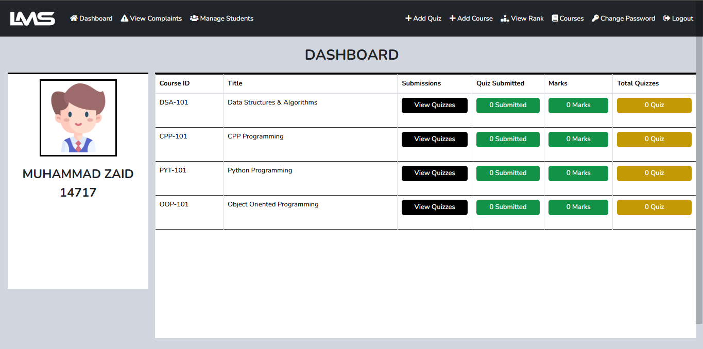
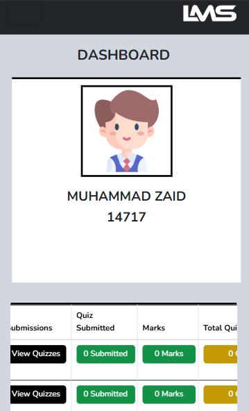

# mini LMS | QMS

Mini LMS (Learning Management System) or you can say QMS (Quiz Management System) is a Django-based web application that helps manage educational resources and activities. This project is designed to streamline course management and enhance learning experiences.

## Project Purpose and Background

This project was initially created as a practice exercise to explore web development with Django. Over time, it evolved into a functional platform for university classmates, providing a space to take quizzes, solve coding challenges, and prepare for exams effectively.

# WEB INTERFACE


# MOBILE INTERFACE



## Features

- User authentication and management
- Course creation and management
- Integrated admin dashboard
- Database-backed storage using SQLite
- Quiz management and participation to enhance learning
- Coding challenges for hands-on practice
- Exam preparation tools to improve performance
- Three user categories with different permissions:
  1. **Super User**: Has no restrictions and can manage the entire platform.
  2. **Staff User**: Has some restrictions and can perform specific administrative tasks.
  3. **Ordinary User**: Can upload quizzes and view their marks and rankings.

---

## Users


## Installation Instructions

### Prerequisites
Ensure you have the following installed on your system:

- Python 3.8+
- pip (Python package installer)
- Virtualenv (optional but recommended)

### Step-by-Step Guide

#### 1. Clone the Repository
```bash
git clone https://github.com/your-username/Django-LMS.git
cd Django-LMS
```

#### 2. Set Up a Virtual Environment (Optional but Recommended)
```bash
pip install virtualenv # to install virtual environment
python -m venv .venv # to create virtual environment
source .venv\Scripts\activate  # to activate venv On Windows
```

#### 3. Install Dependencies
```bash
pip install -r requirements.txt
```

#### 4. Run Database Migrations
```bash
python manage.py makemigrations
python manage.py migrate
```

#### 5. Create a Superuser (Optional, but a default superuser is already provided)
```bash
python manage.py createsuperuser
```

Follow the prompts to set up a username, email, and password.

#### 6. Start the Development Server
```bash
python manage.py runserver
```

Visit the application at [http://127.0.0.1:8000/](http://127.0.0.1:8000/).

---

## Default Superuser Credentials
The project comes with a pre-configured superuser:

- **Username**: 14717
- **Password**: zaidk14717

For security purposes, it is recommended to change the password of this superuser after deploying the project.

```bash
python manage.py changepassword admin
```

---

## Project Structure

```
Django-LMS/
├── base/               # Base templates and utilities
├── studybud/           # Core application logic
├── db.sqlite3          # SQLite database file
├── manage.py           # Django management script
|── LICENSE             # MIT LICENSE
└── requirements.txt    # Python dependencies
```

---

## Contributing

Contributions are welcome! Please fork this repository, create a feature branch, and submit a pull request.

---

## License

This project is licensed under the MIT License. See the `LICENSE` file for details.